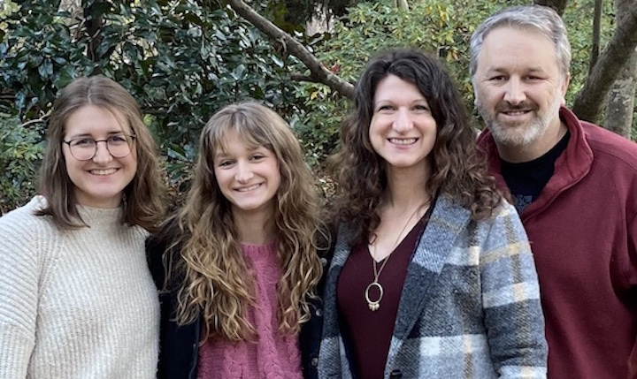

# Eric Starr

<table>
<tr>
    <td width="30%" style="background-color:white;">
        
    </td>
    <td width="70%" style="background-color:white;">
        <ul>
            <li>Twitter: <a target="_blank" href="https://twitter.com/Starrman777">@Starrman777</a>
            <li>LinkedIn: <a target="_blank" href="https://www.linkedin.com/in/starrman/">@starrman</a>
        </ul>
        Eric enjoys good novels, spending time with family and friends, 
         hiking and rock climbing.
    </td> 
</tr>
</table>

Eric has been married to Shari for over 26 years.  Eric and Shari live in Chapel Hill, NC with their dog Sophie.  Their daughters, Linnea and Isabel are students at WCU and are graduating soon.
  

DevOps Director:  Eric is a Subject Matter Expert in Cloud Architecture (AWS) and DevOps

